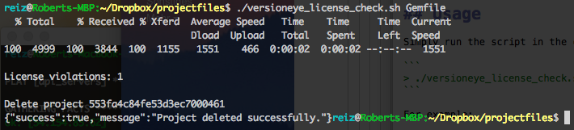

# VersionEye License Check

This shell script is build for developers to quickly check on their dev. machines if a project dependency is violating the [License Whitelist](http://blog.versioneye.com/2014/09/15/license-whitelist/). To use this script you need these: 

 - [jq](http://stedolan.github.io/jq/), a lightweight and flexible command-line JSON processor. Available for Linux, Mac OS X and Windows. 
 - An API Key from [VersionEye](https://www.versioneye.com/).  
 - A default License Whitelist on [VersionEye](https://www.versioneye.com/).

Please make sure that you created a License Whitelist on VersionEye and that you marked one as default. The default Whitelist gets assinged automatically to every new created project. 

On [VersionEye Enterprise](https://www.versioneye.com/enterprise) the admin has to do this. 

## Configuration

Open the script and replace `<YOUR_SECRET_API_KEY>` in line 4 with your actual API KEY. You can get it from [here](https://www.versioneye.com/settings/api). If you are using VersionEye Enterprise please adjust the `VERSIONEYE_SERVER` path in line 3. 

```
#!/bin/bash 

VERSIONEYE_SERVER=https://www.versioneye.com
API_KEY=<YOUR_SECRET_API_KEY> 
```

## Usage

Simply run the script in the command line with any project file as first parameter. 

```
> ./versioneye_license_check.sh <PROJECT_FILE>
```

For example: 

```
> ./versioneye_license_check.sh Gemfile
```

That will upload the `Gemfile` to the VersionEye API and check the dependencies against the default license whitelist. The output will look similar to this. 



In the output you can see how many dependencies are violating the license whitelist. It should be always 0. In this example it is 1. In that case you can use the Web Interface to digg deeper. After the check the project on the VersionEye Server gets deleted immediately. 

Currently VersionEye supports 11 package managers. You can throw any of this project files against the [VersionEye API](https://www.versioneye.com/api/). 

 - Gemfile 
 - Gemfile.lock 
 - Podfile 
 - Podfile.lock 
 - package.json 
 - composer.json 
 - composer.lock
 - bower.json 
 - requirements.txt 
 - setup.py 
 - biicode.conf 
 - pom.xml 
 - project.clj 
 - *.gradle 
 - *.sbt 
 
 For Maven multi module projects (reactor builds) please use the [VersionEye Maven Plugin](https://github.com/versioneye/versioneye_maven_plugin). 
 
## Feedback 

For feedback please open a ticket here on GitHub or contact us on [Twitter](https://twitter.com/versioneye). 
 
 